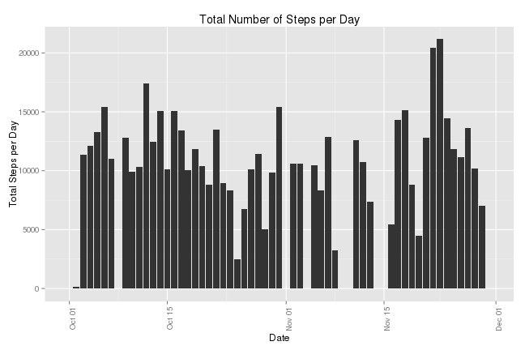
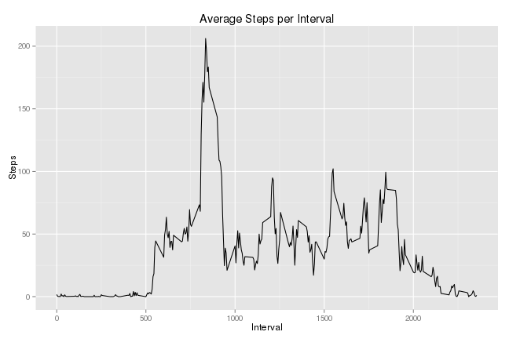
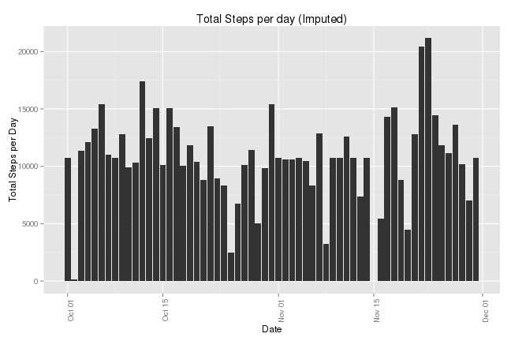
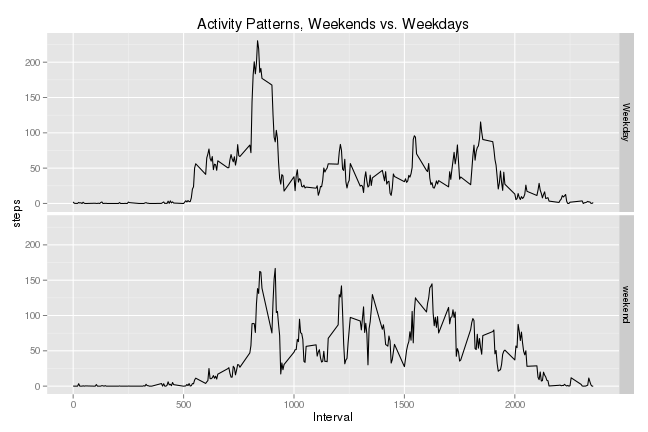

# Reproducible Research: Peer Assessment 1
This file is prepared for the Reproducible Research class in Coursera. It will
answer the questions on the Assignment 1 and includes everything needed to
reproduce the results.

## Loading and preprocessing the data
The source file is included in the git repository and should be in the current working directory if the repository is cloned correctly.  I unzipp the data, read it, and convert the date column to the "Date" class.


```r
#unzip the file, read in the data, and convert the date column to "Date" class
unzip("activity.zip")
act <- read.csv(file="activity.csv", header=T, sep=,)
act$date <- as.Date(act$date)
```

## What is mean total number of steps taken per day?
I first make a histogram of the total number of steps take per day for visual 
inspection.  I ignore the missing data by removing them from the calculation.  

```r
#Aggregate sum of steps by day
totalSteps <- aggregate(act[1], by=list(Date=act$date), FUN=sum, na.rm=T)
require(ggplot2)
```

```
## Loading required package: ggplot2
```

```r
#Plot using the GGPLOT2 package
qp <- qplot(totalSteps$Date, totalSteps$steps, geom="histogram", stat="identity")
qt <- theme(axis.text.x = element_text(angle = 90, hjust = 1))
qp + qt + xlab("Date") + ylab("Total Steps per Day")+ggtitle("Total Number of Steps per Day")
```

 


Then I find the mean and median of the total steps per day:  


```r
mean1 <- mean(totalSteps$steps)
median1 <- median(totalSteps$steps)
```

- The **mean** of Total Steps per Day is: **9354.2295** 
- The **median** of Total Steps per Day is: **10395**   

## What is the average daily activity pattern?

In order to answer this question, I first plot the average steps taken in each interval across all days.  I find this by aggregating the number of steps  by interval and taking the mean.  


```r
#Aggregate mean of steps by interval
intSteps<-aggregate(act$steps, by=list(interval=act$interval), FUN=mean, na.rm=T)
#Plot the steps vs. intervals
qplot(intSteps$interval, intSteps$x, geom="line", main="Average Steps per Interval", xlab="Interval", ylab="Steps")
```

 

I then report the interval across all days that contains the maximum average number of steps.  


```r
maxsteps <- intSteps[which.max(intSteps$x),1]
```

The interval containing the maximum number of steps across all days is **835**.


## Imputing missing values

I will now explore and impute the missing values in the dataset.  I want to find the number of missing values, represented as "NA".  I start by finding out which columns have missing values:

```r
anyNA(act$date)
```

```
## [1] FALSE
```

```r
anyNA(act$interval)
```

```
## [1] FALSE
```

```r
anyNA(act$steps)
```

```
## [1] TRUE
```

Since only steps column contains missing values, I find and record the rows which contain missing values. The length of the resulting array is equal to the number of missing values.


```r
missingRows<-row.names(act[is.na(act$steps),])
missingNo <- length(missingRows)
```

There are **2304** missing values in the dataset.

I next plan to fill in the missing values. Aiming to keep it simple, I have decided that the means of the intervals are the best value since we tend to repeat the daily tasks at roughly the same time of the day. I replace each missing step value with the mean of steps for its interval.


```r
require(plyr)
```

```
## Loading required package: plyr
```

```r
#Use plyr package to merge using interval columns
meanVals<-join(act[missingRows,], intSteps)
```

```
## Joining by: interval
```

Then I construct a new data frame to hold the original dataset with all the missing values filled in.  I opted to use row numbers to replace the missing values in the original order.  I feel this is a good strategy eventhough it may not be strictly necessary.


```r
newAct<-act
newAct[missingRows,1]<-meanVals$x
```

Next, I make a plot of the total steps per day again since missing values have been filled in.


```r
#Aggregate the sum of steps in the new dataset by date
totalSteps<-aggregate(newAct[1], by=list(Date=newAct$date), FUN=sum, na.rm=T)
qp<-qplot(totalSteps$Date, totalSteps$steps, geom="histogram", stat="identity")
qt<-theme(axis.text.x = element_text(angle = 90, hjust = 1))
qp+qt+xlab("Date")+ylab("Total Steps per Day")+ggtitle("Total Steps per day (Imputed)")
```

 

And calculate the mean and median of the new dataset.


```r
mean2 <- mean(totalSteps$steps)
median2 <- median(totalSteps$steps)
```

- The NEW **mean** of Total Steps per Day is: **1.0766 &times; 10<sup>4</sup>** 
- The NEW **median** of Total Steps per Day is: **1.0766 &times; 10<sup>4</sup>**   

As we can see, the numbers are different than the previous findings.  Our mean and median are very close now, indicating that the missing values were acting as outliers, skewing the shape of the distribution of the total steps and causing the median to shift to the left.  This would cause problems with many statistical operations such as regression analysis.

## Are there differences in activity patterns between weekdays and weekends?

In order to explore differences in acticity patterns between weekends and weekdays, I first have to distinguish between them.  I do this by first adding a DoW(day of week) column and set all values to "weekday"", then I use the weekdays function on dates and change the value of DoW to "weekend" for Saturdays and Sundays.  lastly, I make this column to a factor variable.


```r
#Create a new column, DoW, set all its values to weekday
newAct$DoW <- "Weekday"
#Change DoW values to weekend for Saturdays and Sundays
newAct[weekdays(newAct$date) %in% c("Saturday", "Sunday"),4]<-"weekend"
newAct$DoW<-as.factor(newAct$DoW)
```

And then I make a panel plot of the Intervals vs. Average Number of Steps taken on weekdays and weekends.  I first calculate the average steps by aggregating steps by weekend/weekday (DayType) and then by interval and taking the mean.


```r
#Aggregate by DayType and by interval
totalSteps<-aggregate(newAct[1], by=list(DayType=newAct$DoW, Interval=newAct$interval), FUN=mean, na.rm=T)
qplot(Interval, steps, data=totalSteps, geom="line", facets=DayType~., main="Activity Patterns, Weekends vs. Weekdays")
```

 

As we can see from the plot, the activity patterns are distinctly different on weekends than weekdays.  On Weekends the activities are more evently distributed whereas on weekdays the number of steps peak at around 8:30AM.  While we don't really know the reason behind this, it could be speculated that the individual who provided this data engages in some physical activity such as jugging on weekday mornings followed by a less active day at the office.  In contrast, he or she enjoys more active weekends without exercising vigorously for a short period of time.


## End of report
